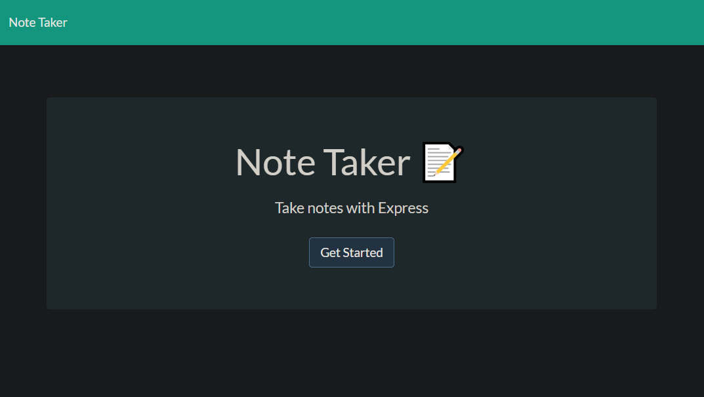
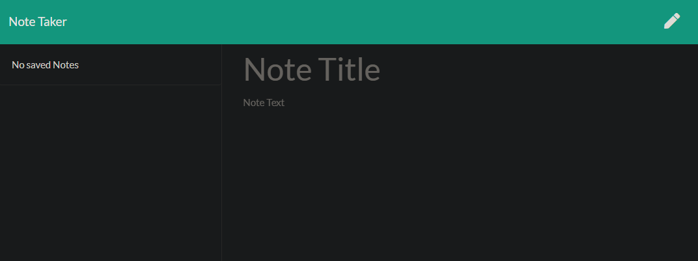
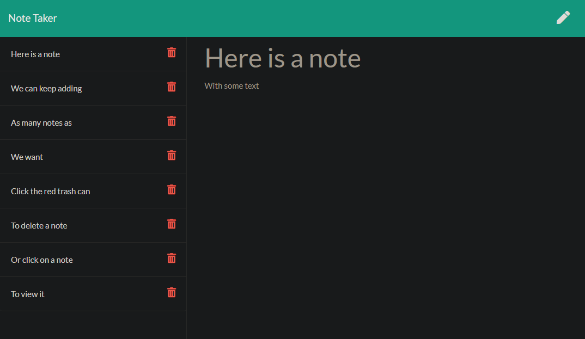

# Fancy Post It Machine

[Heroku deployed app](https://fancy-post-its.herokuapp.com/)

## Description

For users that need to keep track of a lot of information, it's easy to forget or be unable to recall something important. Being able to take persistent notes allows users to have written information available when needed. This application can be used to write, save, and delete notes by using an express backend to save and retrieve data from a JSON file.

## Table of Contents

1. [Installation](#Installation)
2. [Usage](#Usage)
3. [License](#License)
4. [Contributing](#Contributing)
5. [Tests](#Tests)
6. [Questions](#Questions)

## Installation

1. Clone the reop: https://github.com/markdcross/fancy-post-its.git
2. Install NPM Packages via `$ npm i`

## Tech/Skills

1. JavaScript
2. [Node.js](https://nodejs.org/en/)
3. [Express](https://www.npmjs.com/package/express)
4. [UUID](https://www.npmjs.com/package/uuid)

## Usage

The list of saved notes is displayed on the left side of your screen.
You can delete a note by clicking on the red trash can, or review a saved note by clicking on the title.
When a note is added, the screen is cleared so that another note can be created.

## License

Licensed under the [MIT](https://github.com/markdcross/fancy-post-its/blob/master/LICENSE.txt) license.

## Contributing

#### [Contributor Covenant Code of Conduct](https://www.contributor-covenant.org/version/2/0/code_of_conduct/)

## Tests

## Questions

Feel free to contact me with any questions or feedback:

-   GitHub: [markdcross](https://github.com/markdcross)
-   Email: <markdcross@gmail.com>
